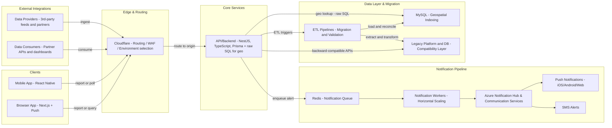

# **Whale Reporting Platform**

## **Summary**

Modernized a legacy whale-alert platform into a low-latency service that delivers sub-second push and SMS notifications to vessels at scale. Led the backend design and zero downtime migration, solving geospatial and throughput challenges within inherited constraints to ship a reliable, production-ready system.

## **Problem**

Vessel strikes are a major threat to whales in busy shipping corridors. The conservation team relied on a legacy platform that was slow, costly to maintain, and could not meet the performance and reliability demands of modern, real-time conservation work.

We needed to:

* Replace the legacy system without disrupting critical operations.

* Deliver alerts to vessels in under one second from sighting.

* Support thousands of daily active users across browser and native apps.

* Maintain backward compatibility for existing API consumers and data providers.

* Migrate large volumes of historical data safely and accurately.

## **Context**

* All ingress flows through Cloudflare for routing, WAF, and environment targeting during rollout.

* External data providers and data consumers integrate via Cloudflare to the NestJS API so we can route to the right environment when needed.

* Delivery model is push notifications and SMS only for browser and native. No WebSockets.

* I inherited Prisma as the ORM decision and worked within that constraint.

## **Solution**

I joined the project after some foundational technology choices were already in place, including Prisma ORM. While Prisma accelerated development for most queries, its lack of native geospatial processing meant we had to use raw SQL and focus on database-level optimizations to meet performance goals.

We approached the rebuild in phases:

* Parallel build and integration: developed the new system alongside the legacy platform to ensure feature parity.

* Data migration and ETL: designed and ran pipelines to extract, transform, and load historical data, validating against both legacy and new schemas.

* Compatibility layer: implemented backward-compatible APIs so existing partners could transition without downtime.

* Gradual cutover: staged rollout with monitoring and fallback readiness.

## **Architecture & Tech**

* **Backend**: NestJS (TypeScript) with Prisma ORM for core queries, supplemented by raw SQL for geospatial lookups.

* **Database**: MySQL with geospatial indexes and query-level tuning for proximity calculations.

* **Ingress and routing**: Cloudflare for routing and WAF. Partners and clients hit Cloudflare first, then the API.

* **Notifications**: Push (browser and native) and SMS via Azure Notification Hub and Azure Communication Services. No WebSockets.

* **Message queue**: Redis for notification queuing and horizontal scaling of alert delivery workers.

* **ETL**: Custom pipelines for legacy data migration, including transformation, validation, and reconciliation.

* **Deployment**: Azure App Services, GitHub Actions for CI/CD, containerized builds for consistency.

* **Monitoring**: Sentry and Azure Application Insights for error tracking, performance profiling, and operational metrics.

## **Engineering Challenges**

* **Inherited constraints**: Worked within existing Prisma adoption, extending with raw SQL for missing geospatial capabilities.

* **Performance tuning**: Optimized MySQL queries with indexing, query refactoring, and targeted caching at the query execution level.

* **Horizontal scaling**: Designed Redis-backed message queues to process high volumes of notifications in parallel.

* **Edge routing and rollout**: Used Cloudflare to control traffic and support staged cutover with straightforward rollback.

* **Zero-downtime migration**: Ran both systems in parallel during cutover to guarantee uninterrupted service.

## **Impact**

* Under one second average from whale sighting submission to vessel alert.

* Seamless retirement of the legacy platform with zero downtime.

* Successful migration of years of historical data without loss.

* Maintained uninterrupted service for all external API consumers and data providers.

* Improved alert delivery capacity through horizontally scaled notification processing.

**Role**: Backend Architect and Lead Developer  
 **Team Size**: 4 developers  
 **Timeframe**: 8 months

## **Diagram**

The system diagram shows client and partner ingress through Cloudflare, the NestJS API and data layer, the Redis queue and workers, Azure delivery, and the legacy compatibility and ETL flows.

