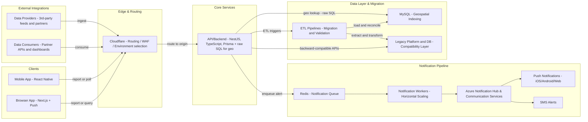

# **Whale Reporting Platform**

## **Summary**

Built a modern, reliable alerting platform that delivers whale sighting notifications to vessels in under one second. Migrated from a legacy system without downtime, kept partners online through a compatibility layer, and handled thousands of daily active users across web and mobile.

## **Problem**

Conservation teams needed a dependable way to alert nearby vessels when whales are reported. The legacy system was slow to evolve, costly to maintain, and not designed for current reliability and scale requirements.

## **Context and constraints**

* Inherited Prisma as the ORM decision at project start.

* Required sub-second alert delivery across browsers and native apps.

* Thousands of DAU during peak periods.

* Backward compatibility for existing data providers and API consumers.

* Safe migration of several years of historical data.

* All ingress flows through Cloudflare for routing and WAF.

## **Solution**

Delivered a new NestJS backend with a notification pipeline that queues and fans out alerts through Redis backed workers. Used raw SQL for geospatial lookups where Prisma lacked native support. Kept external partners stable through a compatibility layer and executed a staged cutover from the legacy platform.

## **Architecture and tech**

* **Core**: NestJS with TypeScript. Prisma for most data access. Raw SQL for geospatial operations.

* **Database**: MySQL with targeted indexing for proximity queries and high read paths.

* **Notifications**: Redis as a notification queue. Horizontally scaled workers dispatch push and SMS via Azure Notification Hub and Azure Communication Services.

* **Ingress**: Cloudflare for routing, WAF, and environment targeting to the origin.

* **ETL**: Custom pipelines for extraction, transformation, validation, and reconciliation of historical data.

* **Deploy and ops**: Azure App Services, containerized builds, CI/CD with GitHub Actions.

* **Observability**: Azure Application Insights and Sentry for performance baselines and error tracking.

## **Engineering challenges**

* **ORM limitations**: Implemented raw SQL for geo queries and tuned indexes to hit performance targets.

* **Horizontal scale**: Designed Redis-backed workers to process high alert volumes in parallel.

* **Compatibility**: Built a translation layer so partners could continue using legacy request and response formats.

* **Zero-downtime migration**: Ran legacy and new systems in parallel with staged traffic cutover.

## **Migration and compatibility approach**

1. Parallel build to achieve feature parity.

2. Data validation against both legacy and new schemas.

3. Backward-compatible endpoints for external partners.

4. Gradual traffic shift through Cloudflare with monitoring and clear rollback.

## **Impact**

* Under one second average from sighting submission to delivered alert.

* Seamless retirement of the legacy platform with no downtime for end users.

* Successful migration of historical data without loss.

* Continued service for all partner integrations and data providers.

* Improved operational efficiency and a simpler support model.

## **My role**

Backend architect and lead developer. Responsible for the alert pipeline design, database strategy for geospatial lookups, Redis worker model, ETL design, and the staged cutover plan.

## **Timeline**

Approximately eight months with a team of four engineers.

## **Diagram**

The system diagram shows client and partner ingress through Cloudflare, the NestJS API and data layer, the Redis queue and workers, Azure delivery, and the legacy compatibility and ETL flows.

